# Multi-Agent AI Trading Platform
## System Architecture & Technical Design Document

| Field | Value |
|---|---|
| **Document** | Architecture & System Design Specification |
| **Status** | Draft for Engineering Hand-off |
| **Version** | 1.0 |
| **Classification** | Internal — Confidential |
| **Scope** | Architecture only. No implementation code. |
| **Instruments** | XAUUSD, BTC, ETH, SOL, DOGE, SHIB |

> **Reading note.** This document is the authoritative design reference for the engineering team. It defines *what* to build and *how the parts relate* — boundaries, contracts, data models, flows, and operational posture. It deliberately does **not** contain application source code. SQL DDL and JSON message contracts are included because they are *interface specifications* (schemas), not implementation logic.

---

## Table of Contents

1. [Executive Summary](#1-executive-summary)
2. [System Overview](#2-system-overview)
3. [Architecture Diagrams](#3-architecture-diagrams)
4. [Agent Specifications](#4-agent-specifications)
5. [Orchestration & Consensus Model](#5-orchestration--consensus-model)
6. [Communication & Event Architecture](#6-communication--event-architecture)
7. [Data Models](#7-data-models)
8. [Security Models](#8-security-models)
9. [Observability Architecture](#9-observability-architecture)
10. [Disaster Recovery](#10-disaster-recovery)
11. [Deployment Models](#11-deployment-models)
12. [Scaling Strategy](#12-scaling-strategy)
13. [Future Roadmap & Extensibility](#13-future-roadmap--extensibility)
14. [Appendix: Glossary & Conventions](#14-appendix-glossary--conventions)

---

## 1. Executive Summary

### 1.1 Purpose

The Multi-Agent AI Trading Platform ("the Platform") is an institutional-grade decision-support and execution-workflow system that analyzes six instruments — Gold (XAUUSD), Bitcoin (BTC), Ethereum (ETH), Solana (SOL), Dogecoin (DOGE), and Shiba Inu (SHIB) — through a federation of specialized AI agents.

The central design tenet is **distributed authority with no single point of decision**. Every analytical agent produces *evidence*, never an order. Evidence is aggregated, conflict-checked, and risk-vetoed through independent validation layers before any action is recorded.

### 1.2 Core Architectural Principles

| # | Principle | Implication |
|---|---|---|
| P1 | **No single agent decides** | Analysis agents emit signals + confidence; only the consensus layer produces a recommendation. |
| P2 | **Multi-layer validation** | Every decision passes Analysis → Risk → Approval → Execution gating. |
| P3 | **Risk has veto power** | The Risk Management Agent can hard-block a decision regardless of bullish consensus (capital preservation overrides opportunity). |
| P4 | **Execution is signal-blind** | The Execution Agent only acts on already-approved decisions and never originates signals. |
| P5 | **Event-driven & replayable** | All inter-agent communication is asynchronous events on a durable, ordered, replayable log. |
| P6 | **Everything is auditable** | Every input, agent output, and decision is persisted with a correlation ID and tamper-evident audit chain. |
| P7 | **Open for extension** | New agents register against stable contracts; consensus weights are config-driven, not code-driven. |
| P8 | **Zero-trust by default** | Mutual TLS, short-lived identities, least-privilege RBAC across every service boundary. |

### 1.3 Key Technology Decisions (and Rationale)

| Concern | Choice | Why |
|---|---|---|
| Event backbone | **Apache Kafka** (or Redpanda) | Durable, partitioned, ordered, replayable — essential for audit, backtest replay, and deterministic recovery. |
| Schema governance | **Schema Registry** (Avro/Protobuf) | Enforces backward-compatible event contracts; prevents silent contract drift between agents. |
| Decision orchestration | **Temporal** (durable workflow engine) | Each decision cycle is a durable, replayable workflow with first-class timeouts, retries, and state — ideal for multi-agent quorum + approval gating. |
| Relational store | **PostgreSQL 16** | Strong consistency for decisions, audit, RBAC, and risk state. |
| Time-series store | **TimescaleDB** (Postgres extension) | Native hypertables/compression for OHLCV and high-frequency metrics without a second database dialect. |
| Cache / coordination | **Redis** | Cycle-state cache, idempotency keys, rate limiting, distributed locks. |
| Object store | **S3-compatible** (MinIO on-prem) | Raw payloads, large news bodies, model artifacts, cold audit exports. |
| Secrets | **HashiCorp Vault** | Dynamic secrets, lease-based DB creds, transit encryption. |
| Identity | **OIDC provider** (e.g., Keycloak) | Centralized human + service identity, token issuance. |
| Runtime | **Kubernetes** | Standard orchestration, autoscaling, declarative HA. |
| Mesh | **Istio / Linkerd** | mTLS everywhere, traffic policy, zero-trust enforcement. |
| Telemetry | **OpenTelemetry → Prometheus / Tempo / Loki / Grafana** | Unified metrics, traces, logs across all agents. |

### 1.4 What the Platform Is — and Is Not

- **It is** a decision-support and workflow-of-record system: it analyzes markets, forms validated recommendations, and records the approved workflow with a full audit trail.
- **It is not** (in this version) a self-directed autonomous trader. The Execution Agent manages and records the *execution workflow*; live broker/exchange order routing is treated as an external integration boundary documented in §4.6, gated behind human/automated approval policy.

---

## 2. System Overview

### 2.1 Logical Layers

The Platform is organized into seven horizontal layers. Each layer has a single responsibility and communicates with adjacent layers only through defined contracts.

| Layer | Responsibility | Key Components |
|---|---|---|
| **L1 — Ingestion** | Acquire and normalize external data | Market feed adapters, on-chain collectors, exchange-stats collectors, news collectors |
| **L2 — Normalization & Feature** | Clean, validate, enrich, and publish canonical events | Validators, feature builders, deduplication, schema enforcement |
| **L3 — Agent** | Specialized analysis & validation | Market Structure, Whale Intelligence, News Intelligence, Risk Management, Approval, Execution |
| **L4 — Orchestration** | Drive decision cycles, dependency, quorum, consensus | Temporal workflows, scheduler, consensus engine, agent registry |
| **L5 — Messaging** | Durable async transport | Kafka topics, schema registry, dead-letter queues |
| **L6 — Persistence** | Systems of record & state | PostgreSQL, TimescaleDB, Redis, S3 |
| **L7 — Platform Services** | Cross-cutting | Security (Vault, OIDC), Observability, Config, API gateway |

### 2.2 The Decision Cycle (Conceptual)

The unit of work is a **Decision Cycle**: a fully traceable, correlation-ID-stamped sequence triggered for one `(instrument, timeframe)` pair.

```
Trigger ─▶ Orchestrator opens Cycle (cycle_id)
        ─▶ Analysis agents run in parallel (Market / Whale / News)
        ─▶ Risk Agent consumes analysis + portfolio state
        ─▶ Approval Agent aggregates → APPROVE | REJECT | HOLD
        ─▶ (if APPROVE) Execution Agent records & manages workflow
        ─▶ Cycle closed; audit chain sealed
```

Every artifact produced during a cycle shares the same `cycle_id`, enabling end-to-end tracing, replay, and post-hoc audit.

### 2.3 Service Boundaries

Each agent is an independently deployable service with its own scaling profile, its own database schema/ownership, and a single inbound + outbound event contract. No agent reads another agent's private tables; all cross-agent data moves as events.

| Service | Owns (data) | Consumes (topics) | Produces (topics) | Scaling driver |
|---|---|---|---|---|
| Market Structure Agent | `market_data.*` read models | `md.normalized`, `cycle.analysis.requested` | `agent.result` | CPU / feed volume |
| Whale Intelligence Agent | `whale.*` | `chain.normalized`, `exchange.stats`, `cycle.analysis.requested` | `agent.result` | On-chain event volume |
| News Intelligence Agent | `news.*` | `news.normalized`, `cycle.analysis.requested` | `agent.result` | NLP inference load |
| Risk Management Agent | `risk.*`, `portfolio.*` | `agent.result`, `portfolio.state` | `agent.result` (risk), `risk.veto` | Portfolio complexity |
| Approval Agent | `decisions.*` | `agent.result`, `risk.veto` | `decision.made` | Cycle throughput |
| Execution Agent | `executions.*`, `audit.*` | `decision.made` (approved only) | `execution.recorded` | Decision throughput |
| Orchestrator | `cycles.*`, `agent_registry.*` | `cycle.*`, `decision.made` | `cycle.analysis.requested`, `cycle.closed` | Cycle concurrency |

---

## 3. Architecture Diagrams

### 3.1 High-Level Architecture

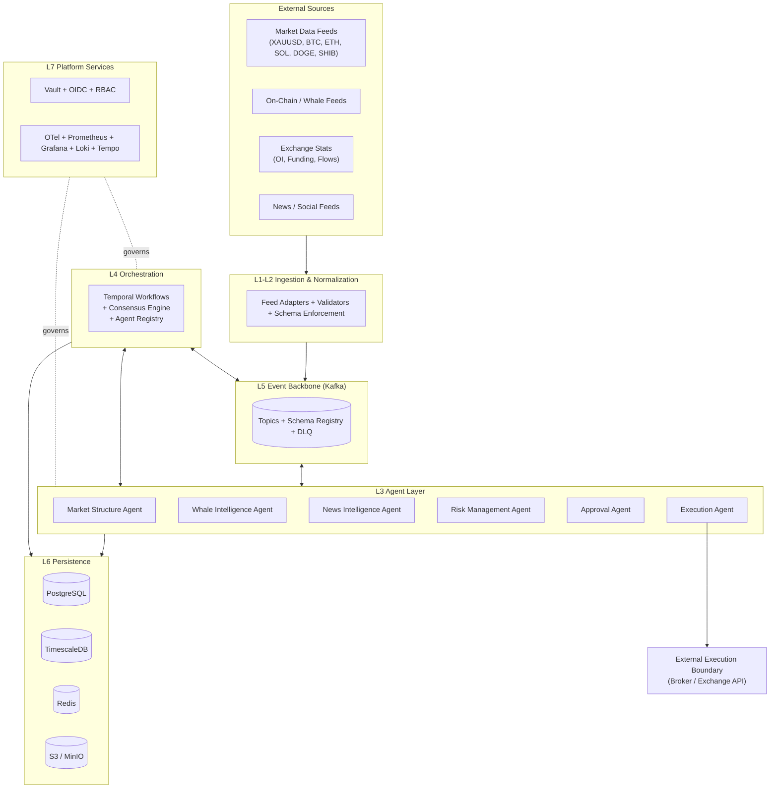

### 3.2 Detailed Architecture (Layered)

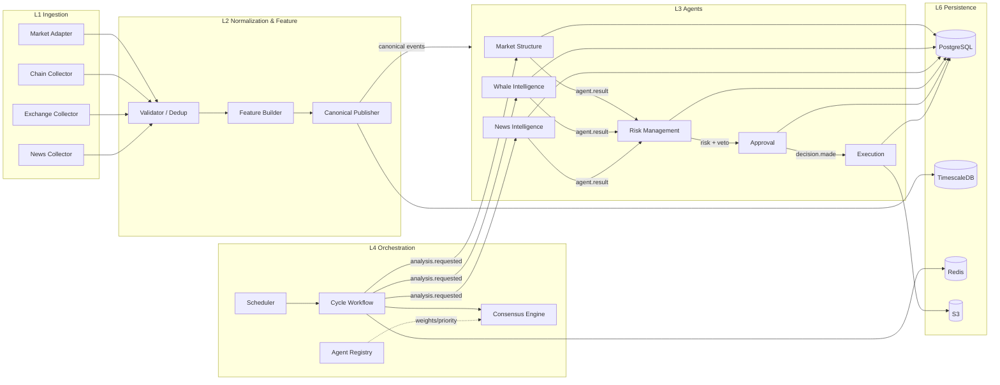

### 3.3 Agent Interaction Diagram

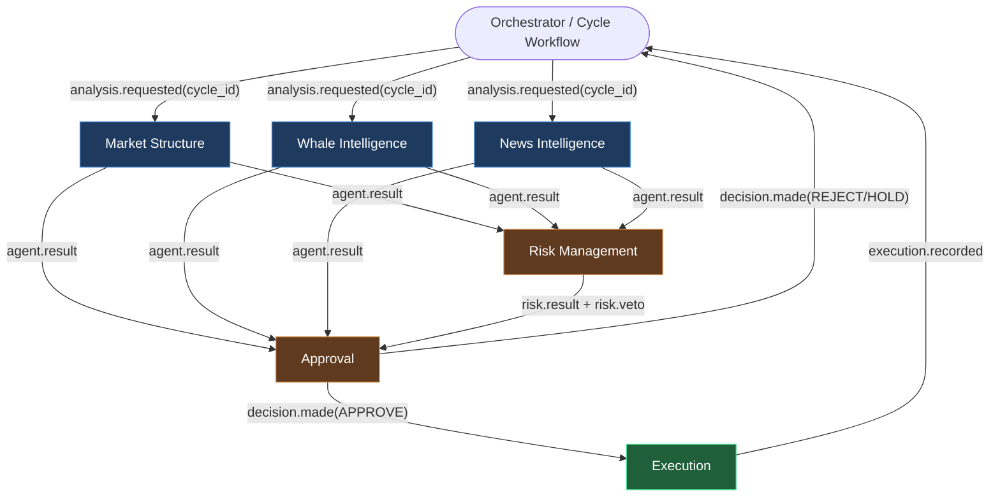

### 3.4 Agent Dependency Graph

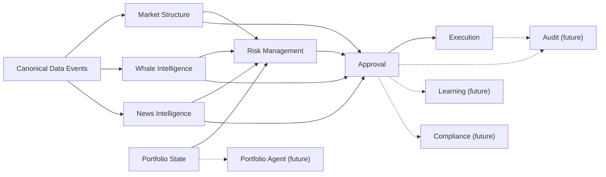

**Dependency tiers** (used by the scheduler to order execution):

- **Tier 0 (independent):** Market Structure, Whale Intelligence, News Intelligence — depend only on data events.
- **Tier 1:** Risk Management — depends on Tier-0 results + portfolio state.
- **Tier 2:** Approval — depends on all Tier-0 + Tier-1 results.
- **Tier 3:** Execution — depends on an APPROVED Approval decision.

### 3.5 Component Diagram (Single Agent Internal Structure)

All analysis agents share a common internal component skeleton; only the analytics core differs.

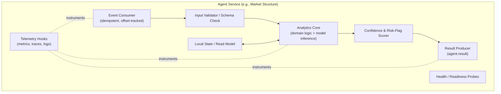

### 3.6 Sequence Diagram — Full Decision Cycle

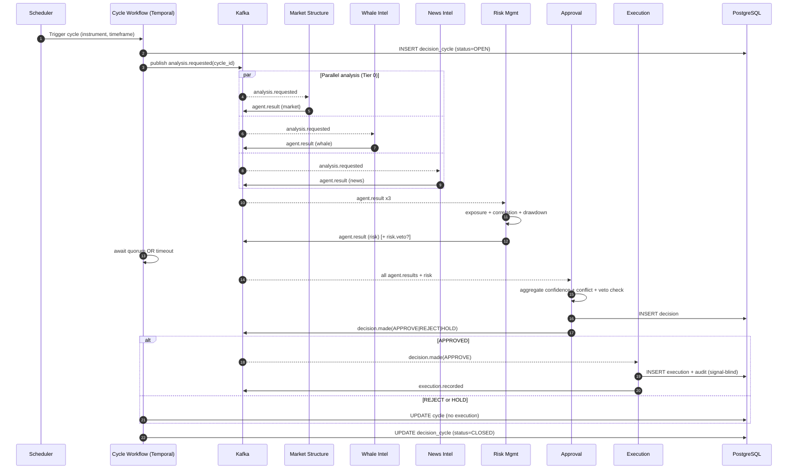

### 3.7 Event Flow Diagram

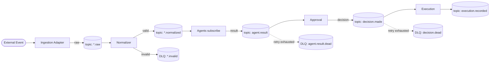

---

## 4. Agent Specifications

Each agent specification below defines: responsibilities, inputs, outputs, contract schema, internal sub-modules, failure behavior, and scaling characteristics. **All agents implement the common agent contract** (§4.0) so the consensus layer treats them uniformly.

### 4.0 Common Agent Contract

Every analysis/validation agent publishes an `agent.result` envelope. This is a *schema specification*, not code.

```json
{
  "schema_version": "1.0",
  "result_id": "uuid",
  "cycle_id": "uuid",
  "agent_type": "MARKET_STRUCTURE | WHALE_INTEL | NEWS_INTEL | RISK_MGMT",
  "agent_version": "semver",
  "instrument": "XAUUSD | BTC | ETH | SOL | DOGE | SHIB",
  "timeframe": "1m | 5m | 15m | 1h | 4h | 1d",
  "signal": "STRONG_BUY | BUY | NEUTRAL | SELL | STRONG_SELL | NONE",
  "confidence": 0.0,
  "explanation": "human-readable rationale",
  "risk_flags": ["LOW_LIQUIDITY", "HIGH_VOLATILITY", "..."],
  "evidence": { "agent_specific": "structured payload" },
  "produced_at": "RFC3339 timestamp",
  "input_window": { "from": "RFC3339", "to": "RFC3339" },
  "trace_id": "w3c-traceparent"
}
```

**Universal rules**

- `confidence ∈ [0.0, 1.0]`. A result with `signal=NONE` must carry `confidence=0.0` and explain why (e.g., insufficient data).
- Every result is **idempotent** by `(cycle_id, agent_type, agent_version)`. Re-delivery overwrites nothing already committed.
- An agent that cannot produce within the cycle deadline emits no result; the orchestrator records a `TIMEOUT` participation status.

---

### 4.1 Market Structure Agent

**Mission:** Quantify the *technical state* of each instrument across timeframes.

| Aspect | Specification |
|---|---|
| **Responsibilities** | Trend analysis, market-structure analysis (BOS/CHoCH, swing points), volatility analysis, liquidity analysis, multi-timeframe alignment, confidence scoring |
| **Inputs** | `md.normalized` (OHLCV + derived indicators), `cycle.analysis.requested` |
| **Outputs** | `signal`, `confidence`, `explanation`, `risk_flags` |
| **Sub-modules** | Trend Engine, Structure Detector, Volatility Estimator, Liquidity Mapper, MTF Aligner, Scorer |
| **Risk flags emitted** | `LOW_LIQUIDITY`, `HIGH_VOLATILITY`, `RANGE_BOUND`, `MTF_CONFLICT`, `STALE_DATA` |
| **Failure mode** | On stale/missing data → `signal=NONE`, flag `STALE_DATA`. Never blocks the cycle. |
| **Scaling** | Horizontal per-instrument partitioning; CPU-bound. |

**Evidence payload (excerpt):**
```json
{ "trend": { "1h": "UP", "4h": "UP", "1d": "RANGE" },
  "structure": { "last_event": "BOS_UP", "swing_high": 0, "swing_low": 0 },
  "volatility": { "atr_pct": 0.0, "regime": "EXPANDING" },
  "liquidity": { "nearest_pool": 0, "depth_score": 0.0 },
  "mtf_alignment_score": 0.0 }
```

---

### 4.2 Whale Intelligence Agent

**Mission:** Detect large-actor behavior and derivative-market pressure (crypto instruments primarily; XAUUSD via proxy flows).

| Aspect | Specification |
|---|---|
| **Responsibilities** | Large-transaction monitoring, exchange inflow/outflow analysis, open-interest analysis, funding-rate analysis, abnormal-activity detection |
| **Inputs** | `chain.normalized` (large txs, exchange wallet movements), `exchange.stats` (OI, funding), `cycle.analysis.requested` |
| **Outputs** | `whale_sentiment` (mapped to `signal`), `confidence`, `risk_indicators` (mapped to `risk_flags`) |
| **Sub-modules** | Tx Monitor, Flow Analyzer, OI Analyzer, Funding Analyzer, Anomaly Detector |
| **Risk flags emitted** | `LARGE_INFLOW_SPIKE`, `FUNDING_EXTREME`, `OI_DIVERGENCE`, `ANOMALOUS_CLUSTER`, `NO_ONCHAIN_DATA` |
| **Failure mode** | XAUUSD has no native on-chain data → emits `signal=NONE` with `NO_ONCHAIN_DATA`, relies on flow proxies only. |
| **Scaling** | Partition by chain + instrument; event-volume bound. |

**Evidence payload (excerpt):**
```json
{ "net_exchange_flow_usd": 0, "flow_direction": "OUTFLOW",
  "open_interest": { "value": 0, "delta_24h_pct": 0.0 },
  "funding_rate": { "current": 0.0, "percentile": 0.0 },
  "anomalies": [ { "type": "WHALE_ACCUMULATION", "score": 0.0 } ] }
```

---

### 4.3 News Intelligence Agent

**Mission:** Convert unstructured news/social into structured market impact.

| Aspect | Specification |
|---|---|
| **Responsibilities** | News aggregation, sentiment analysis, event classification, market-impact estimation |
| **Inputs** | `news.normalized` (deduplicated articles/posts), `cycle.analysis.requested` |
| **Outputs** | `sentiment_score` (→ `signal`), `impact_score`, `risk_level` (→ `risk_flags`) |
| **Sub-modules** | Aggregator, Sentiment Model, Event Classifier, Impact Estimator |
| **Event classes** | `REGULATORY`, `MACRO`, `HACK_EXPLOIT`, `LISTING_DELISTING`, `MACRO_RATE`, `SOCIAL_HYPE`, `OTHER` |
| **Risk flags emitted** | `HIGH_IMPACT_EVENT`, `REGULATORY_RISK`, `SECURITY_INCIDENT`, `LOW_SOURCE_CREDIBILITY`, `RUMOR_UNVERIFIED` |
| **Failure mode** | No relevant news in window → `signal=NEUTRAL`, `impact_score=0`. |
| **Scaling** | NLP-inference bound; GPU pool optional; batch + stream hybrid. |

**Evidence payload (excerpt):**
```json
{ "sentiment_score": 0.0, "impact_score": 0.0,
  "top_events": [ { "class": "REGULATORY", "headline_ref": "s3://...", "impact": 0.0, "credibility": 0.0 } ],
  "article_count": 0, "window_minutes": 60 }
```

---

### 4.4 Risk Management Agent

**Mission:** Independent guardian of capital. Consumes other agents' outputs + portfolio state and may **veto**.

| Aspect | Specification |
|---|---|
| **Responsibilities** | Exposure analysis, portfolio-risk analysis, correlation analysis, drawdown monitoring, capital preservation |
| **Inputs** | `agent.result` (Market/Whale/News), `portfolio.state` (positions, equity, open risk) |
| **Outputs** | `risk_score`, `risk_level`, `approval_recommendation`, and a separate **`risk.veto`** event when hard limits are breached |
| **Sub-modules** | Exposure Calc, Correlation Matrix, Drawdown Monitor, Limit Engine, Capital-Preservation Rules |
| **Risk levels** | `LOW`, `MODERATE`, `ELEVATED`, `HIGH`, `CRITICAL` |
| **Veto triggers (examples)** | Portfolio drawdown > threshold; correlated exposure > cap; instrument volatility regime = extreme; single-asset concentration > limit |
| **Failure mode** | If portfolio state is unavailable → defaults to **conservative veto** (`risk.veto=true`), never optimistic. |
| **Scaling** | Stateful; co-located with portfolio read model; vertically scaled. |

> **Design rule:** The Risk Agent's veto is *non-overridable by consensus*. The Approval Agent must respect an active `risk.veto` and convert any would-be APPROVE into REJECT or HOLD per policy (§5.4).

**Evidence payload (excerpt):**
```json
{ "risk_score": 0.0, "risk_level": "MODERATE",
  "exposure": { "gross_pct": 0.0, "net_pct": 0.0, "by_instrument": {} },
  "correlation": { "cluster": "CRYPTO_BETA", "max_pairwise": 0.0 },
  "drawdown": { "current_pct": 0.0, "max_allowed_pct": 0.0 },
  "veto": false, "approval_recommendation": "APPROVE | CONDITIONAL | REJECT" }
```

---

### 4.5 Approval Agent

**Mission:** The single consensus authority. It is the *only* component that emits a recommendation — and it does so deterministically from the evidence, never from fresh market analysis.

| Aspect | Specification |
|---|---|
| **Responsibilities** | Receive all agent outputs, aggregate confidence, detect conflicting signals, apply risk veto, generate final recommendation + rationale |
| **Inputs** | `agent.result` (all agents for a cycle), `risk.veto` |
| **Outputs** | `recommendation ∈ {APPROVE, REJECT, HOLD}`, aggregate `confidence`, `decision_rationale` |
| **Sub-modules** | Quorum Gate, Weighted Aggregator, Conflict Detector, Veto Enforcer, Rationale Composer |
| **Failure mode** | Quorum not met within deadline → `HOLD` with rationale `INSUFFICIENT_QUORUM`. |
| **Scaling** | Stateless per cycle; horizontally scalable by `cycle_id` partition. |

**Decision schema (`decision.made`):**
```json
{ "schema_version": "1.0", "decision_id": "uuid", "cycle_id": "uuid",
  "instrument": "BTC", "timeframe": "1h",
  "recommendation": "APPROVE | REJECT | HOLD",
  "aggregate_confidence": 0.0,
  "contributing_results": ["result_id", "..."],
  "conflict_detected": false,
  "risk_veto_applied": false,
  "decision_rationale": "text",
  "policy_version": "semver",
  "decided_at": "RFC3339", "trace_id": "..." }
```

---

### 4.6 Execution Agent

**Mission:** Turn an approved decision into a recorded, audited workflow. **It is signal-blind**: it performs no analysis and originates no signal.

| Aspect | Specification |
|---|---|
| **Responsibilities** | Receive approved recommendations, record actions, maintain audit trail, manage execution workflow |
| **Inputs** | `decision.made` filtered to `recommendation=APPROVE` only |
| **Outputs** | `execution.recorded`, audit-chain entries |
| **Hard constraints** | MUST reject any input where `recommendation != APPROVE`. MUST NOT compute signals, confidence, or market views. MUST be idempotent by `decision_id`. |
| **Sub-modules** | Decision Validator, Workflow State Machine, Audit Writer, External-Boundary Adapter (gated) |
| **Workflow states** | `RECEIVED → VALIDATED → STAGED → DISPATCHED → ACKED → SETTLED` (or `→ FAILED → COMPENSATED`) |
| **Failure mode** | External boundary failure → workflow enters `FAILED`, emits compensation event, audit records full chain; never silently drops. |
| **Scaling** | Throughput bound; Temporal-backed durable workflow ensures exactly-once side effects. |

**Execution workflow state machine:**

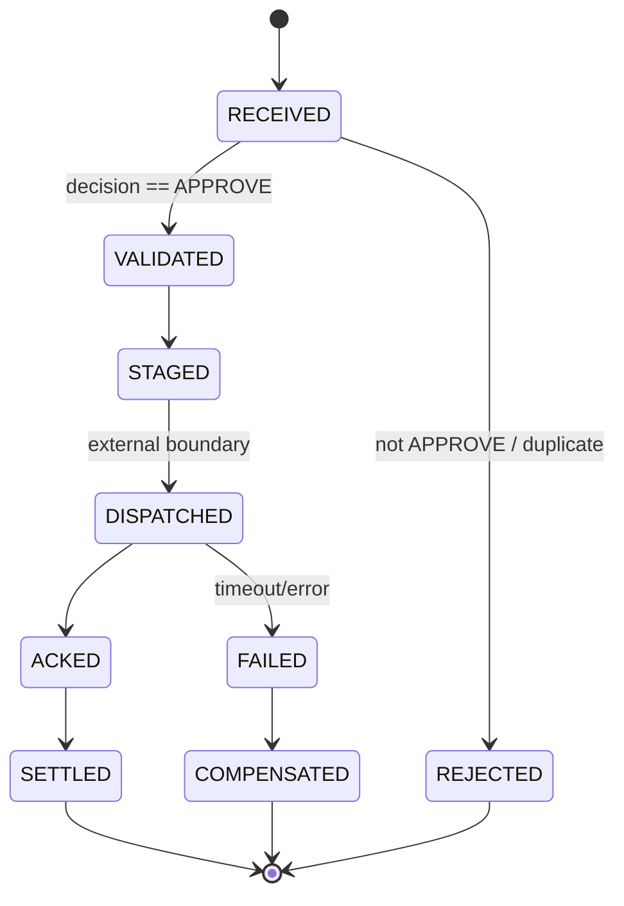

> **Boundary note.** Live order routing to a broker/exchange is an *external integration* behind the Execution Agent. In v1 the agent records and stages the workflow; whether `DISPATCHED` reaches a live venue is governed by deployment policy (paper-trade vs. live, plus optional human gate). This keeps the autonomous-trading risk surface explicit and configurable.

---

## 5. Orchestration & Consensus Model

### 5.1 Orchestration Engine

The orchestrator is implemented as a **durable workflow** (Temporal). Each Decision Cycle is one workflow execution, giving us deterministic replay, automatic retries, timers/timeouts, and a complete history for free — properties that map directly to auditability and disaster recovery requirements.

**Why a durable workflow rather than ad-hoc event choreography:** quorum-waiting, partial-failure handling, and "wait for N agents or timeout" logic are notoriously fragile when spread across stateless consumers. A workflow centralizes the cycle's lifecycle while agents remain decoupled event consumers.

### 5.2 Agent Scheduling & Priorities

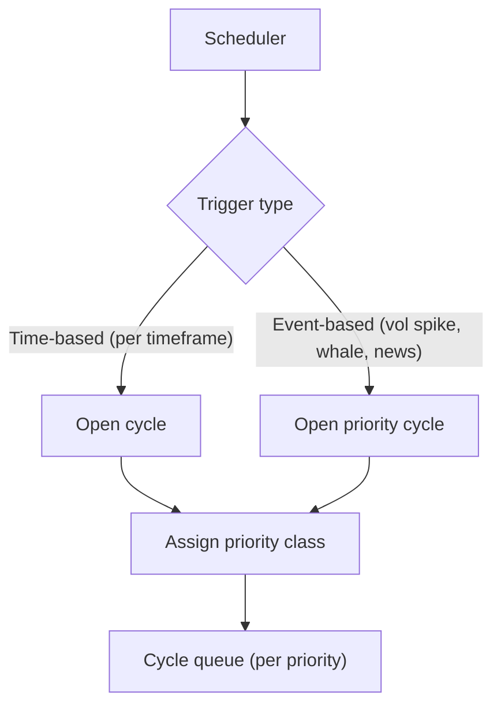

| Priority class | Trigger | SLA target | Preemption |
|---|---|---|---|
| **P0 — Critical** | Risk breach / extreme event | sub-second open | Yes |
| **P1 — Event** | News high-impact, whale spike | seconds | Partial |
| **P2 — Scheduled** | Regular timeframe ticks | best-effort | No |

Per-agent priority and resource weight are read from the **Agent Registry** (config-driven, hot-reloadable), so adding/retuning agents requires no orchestrator code change.

### 5.3 Agent Registry (config-driven extensibility)

```json
{
  "agent_type": "MARKET_STRUCTURE",
  "version": "1.4.2",
  "enabled": true,
  "tier": 0,
  "consensus_weight": 0.30,
  "priority_class": "P2",
  "required_for_quorum": true,
  "timeout_ms": 4000,
  "veto_capable": false
}
```

Adding a future agent (Portfolio, Strategy, etc.) = inserting a registry row + deploying the service. The consensus engine reads weights dynamically.

### 5.4 Consensus Model

The Approval Agent computes a recommendation in four deterministic stages:

**Stage 1 — Quorum Gate.**
A cycle is eligible for a decision only when all `required_for_quorum=true` agents have produced a result *or* the cycle deadline elapses. If quorum fails → `HOLD (INSUFFICIENT_QUORUM)`.

**Stage 2 — Weighted Aggregation.**
Each signal is mapped to a directional score `s ∈ [-1, +1]` (`STRONG_SELL=-1 … STRONG_BUY=+1`). The aggregate is the confidence-and-registry-weighted mean:

```
direction_score = Σ ( wᵢ · confidenceᵢ · signal_scoreᵢ ) / Σ ( wᵢ · confidenceᵢ )
aggregate_confidence = Σ ( wᵢ · confidenceᵢ ) / Σ ( wᵢ )
```
where `wᵢ` = registry consensus weight of agent *i*.

**Stage 3 — Conflict Detection.**
A conflict is flagged when directional disagreement and individual confidences are both high — e.g., Market Structure `STRONG_BUY @0.8` vs. News `STRONG_SELL @0.8`. The detector computes a dispersion metric; high dispersion forces the outcome toward `HOLD` even if the weighted mean is non-zero. This prevents "averaging away" a genuine contradiction.

**Stage 4 — Veto Enforcement.**
If an active `risk.veto` exists for the cycle, the recommendation is clamped: a would-be `APPROVE` becomes `REJECT` (hard veto) or `HOLD` (soft veto) per `policy_version`. The veto is logged in `risk_veto_applied`.

**Outcome mapping (illustrative thresholds, policy-versioned):**

| Condition | Recommendation |
|---|---|
| Veto active (hard) | `REJECT` |
| Veto active (soft) or quorum fail | `HOLD` |
| High conflict dispersion | `HOLD` |
| `|direction_score| ≥ τ_approve` AND `aggregate_confidence ≥ τ_conf` AND no veto | `APPROVE` |
| `|direction_score| < τ_neutral` | `HOLD` |
| Otherwise | `REJECT` |

All thresholds (`τ_*`) live in versioned policy config and are recorded on every decision for reproducibility.

### 5.5 Approval Workflow

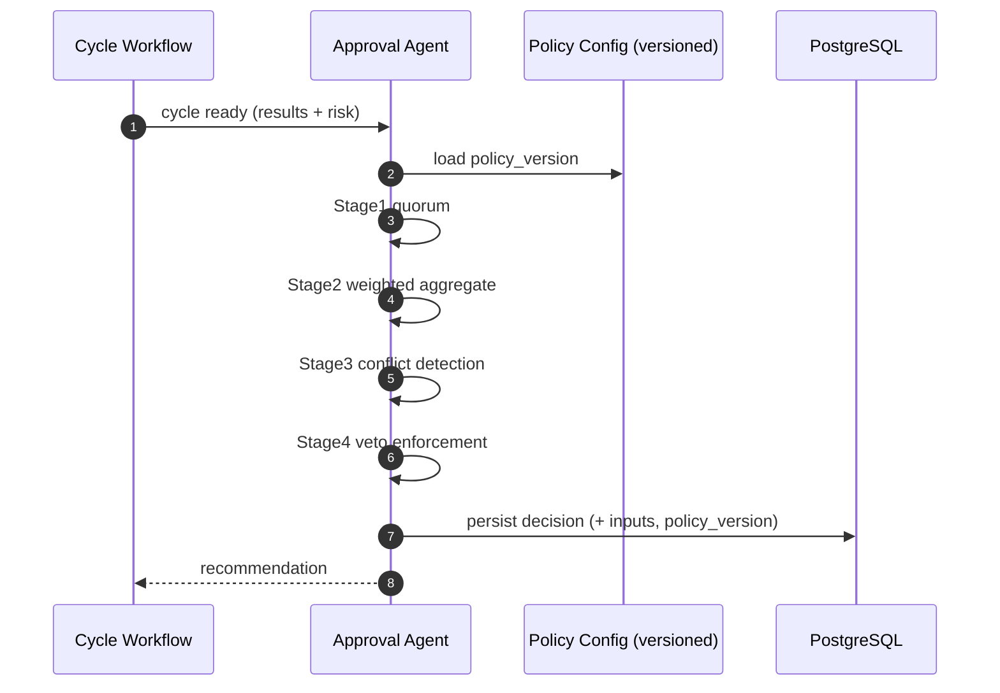

---

## 6. Communication & Event Architecture

### 6.1 Messaging Topology (Kafka)

| Topic | Key | Partitions by | Retention | Producers | Consumers |
|---|---|---|---|---|---|
| `md.raw` | instrument | instrument | 7d | Market Adapter | Normalizer |
| `md.normalized` | instrument | instrument | 30d | Normalizer | Market Structure |
| `chain.normalized` | instrument | instrument | 30d | Chain Normalizer | Whale Intel |
| `exchange.stats` | instrument | instrument | 30d | Exchange Collector | Whale Intel |
| `news.normalized` | instrument | instrument | 30d | News Normalizer | News Intel |
| `cycle.analysis.requested` | cycle_id | cycle_id | 7d | Orchestrator | Tier-0 agents |
| `agent.result` | cycle_id | cycle_id | 90d | All analysis agents | Risk, Approval |
| `risk.veto` | cycle_id | cycle_id | 90d | Risk Agent | Approval |
| `decision.made` | cycle_id | cycle_id | infinite (compacted+archived) | Approval | Execution, Audit |
| `execution.recorded` | decision_id | decision_id | infinite | Execution | Orchestrator, Audit |
| `*.dlq` | original key | — | 30d | Any | Ops / replay tooling |

**Keying rationale:** keying `agent.result`/`decision.made` by `cycle_id` guarantees ordering of all artifacts within a cycle on a single partition, which the consensus and audit logic depend on.

### 6.2 Event-Driven Patterns

- **Choreography for data flow** (ingestion → agents): loosely coupled pub/sub.
- **Orchestration for the decision lifecycle** (cycle → approval → execution): centralized durable workflow.
- **Event sourcing for audit**: `decision.made` and `execution.recorded` are append-only, archived indefinitely, and form the replayable system-of-record.

### 6.3 Agent Communication Protocols

| Concern | Standard |
|---|---|
| Serialization | Avro or Protobuf via Schema Registry (binary, compact, versioned) |
| Compatibility | **Backward + forward** compatibility enforced by registry; breaking changes require new `schema_version` + dual-publish window |
| Delivery | At-least-once; consumers idempotent by natural key (`cycle_id`+`agent_type`, `decision_id`) |
| Ordering | Per-partition (per `cycle_id`) ordering guarantee |
| Correlation | `cycle_id` + W3C `traceparent` propagated on every message header |
| Control plane (sync, optional) | gRPC with mTLS for health/registry queries — never for decision data |
| Time | All timestamps RFC3339 UTC; cycle deadlines are workflow timers, not wall-clock in agents |

### 6.4 Retry, Failure Recovery & Idempotency

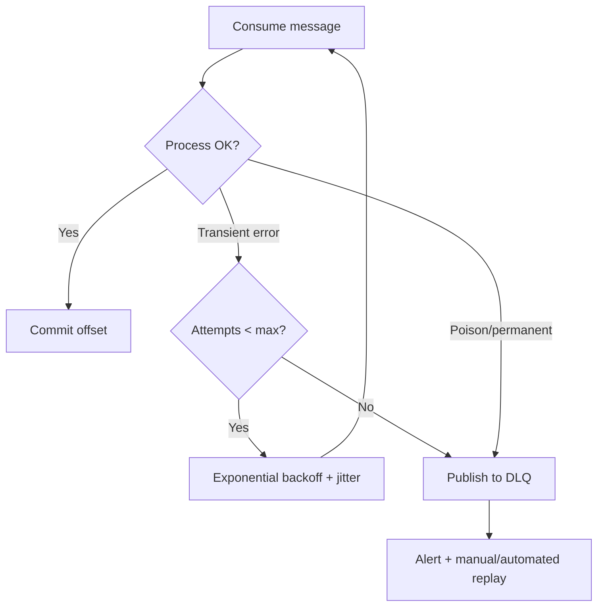

| Mechanism | Policy |
|---|---|
| Retry | Exponential backoff with jitter; max attempts per topic class (e.g., 5 for data, 3 for decisions) |
| Dead-letter | Per-topic DLQ with original payload + failure metadata; replayable via Ops tooling |
| Idempotency | Natural-key dedup table in Redis (TTL) + DB unique constraints |
| Partial quorum | Missing agent → recorded as `TIMEOUT`; consensus proceeds with reduced participants and lowered `aggregate_confidence`, biasing toward `HOLD` |
| Exactly-once side effects | Execution side effects wrapped in Temporal activities (idempotent by `decision_id`) |
| Poison messages | Schema-invalid events routed to `*.invalid` DLQ at the normalization boundary, never reaching agents |

---

## 7. Data Models

### 7.1 Storage Strategy

| Data class | Store | Reason |
|---|---|---|
| Decisions, agent results, audit, risk, RBAC, registry | **PostgreSQL 16** | Strong consistency, relational integrity, transactional audit |
| Market OHLCV, high-frequency metrics, whale time-series | **TimescaleDB** (hypertables) | Compression, partitioning, time-bucketing |
| Cycle state, idempotency keys, locks, rate limits | **Redis** | Low-latency ephemeral state |
| Raw news bodies, large payloads, model artifacts, cold audit exports | **S3 / MinIO** | Cheap durable blob storage; DB rows hold references |

**Schema ownership.** Each agent owns its schema namespace; cross-agent reads happen via events or read-replicas, never direct foreign writes. Logical schemas: `core`, `agents`, `decision`, `risk`, `market`, `news`, `whale`, `audit`, `security`.

### 7.2 Entity-Relationship Overview

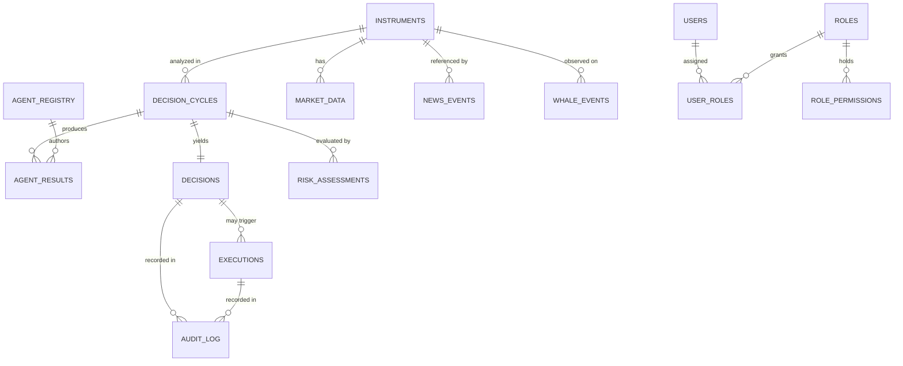

### 7.3 Core & Registry Schema

```sql
-- ============ schema: core ============
CREATE TABLE core.instruments (
    instrument_id   SMALLINT PRIMARY KEY,
    symbol          TEXT NOT NULL UNIQUE,          -- 'XAUUSD','BTC','ETH','SOL','DOGE','SHIB'
    asset_class     TEXT NOT NULL,                 -- 'METAL','CRYPTO'
    base_ccy        TEXT NOT NULL,
    quote_ccy       TEXT NOT NULL,
    is_active       BOOLEAN NOT NULL DEFAULT TRUE,
    created_at      TIMESTAMPTZ NOT NULL DEFAULT now()
);

CREATE TABLE core.decision_cycles (
    cycle_id        UUID PRIMARY KEY,
    instrument_id   SMALLINT NOT NULL REFERENCES core.instruments(instrument_id),
    timeframe       TEXT NOT NULL,                 -- '1m','5m','15m','1h','4h','1d'
    trigger_type    TEXT NOT NULL,                 -- 'SCHEDULED','EVENT','MANUAL'
    priority_class  TEXT NOT NULL DEFAULT 'P2',
    status          TEXT NOT NULL DEFAULT 'OPEN',  -- 'OPEN','AGGREGATING','CLOSED','TIMEOUT','ERROR'
    opened_at       TIMESTAMPTZ NOT NULL DEFAULT now(),
    closed_at       TIMESTAMPTZ,
    policy_version  TEXT,
    trace_id        TEXT
);

-- ============ schema: agents ============
CREATE TABLE agents.agent_registry (
    agent_type        TEXT NOT NULL,
    version           TEXT NOT NULL,
    enabled           BOOLEAN NOT NULL DEFAULT TRUE,
    tier              SMALLINT NOT NULL,           -- 0,1,2,3
    consensus_weight  NUMERIC(4,3) NOT NULL,       -- 0.000..1.000
    priority_class    TEXT NOT NULL DEFAULT 'P2',
    required_for_quorum BOOLEAN NOT NULL DEFAULT TRUE,
    timeout_ms        INTEGER NOT NULL DEFAULT 4000,
    veto_capable      BOOLEAN NOT NULL DEFAULT FALSE,
    updated_at        TIMESTAMPTZ NOT NULL DEFAULT now(),
    PRIMARY KEY (agent_type, version)
);

CREATE TABLE agents.agent_results (
    result_id       UUID PRIMARY KEY,
    cycle_id        UUID NOT NULL REFERENCES core.decision_cycles(cycle_id),
    agent_type      TEXT NOT NULL,
    agent_version   TEXT NOT NULL,
    instrument_id   SMALLINT NOT NULL REFERENCES core.instruments(instrument_id),
    timeframe       TEXT NOT NULL,
    signal          TEXT NOT NULL,                 -- enum-like, app-enforced
    confidence      NUMERIC(4,3) NOT NULL CHECK (confidence BETWEEN 0 AND 1),
    explanation     TEXT,
    risk_flags      JSONB NOT NULL DEFAULT '[]',
    evidence        JSONB NOT NULL DEFAULT '{}',
    input_window    TSTZRANGE,
    produced_at     TIMESTAMPTZ NOT NULL DEFAULT now(),
    trace_id        TEXT,
    UNIQUE (cycle_id, agent_type, agent_version)   -- idempotency
);
```

### 7.4 Decision & Execution Schema

```sql
-- ============ schema: decision ============
CREATE TABLE decision.decisions (
    decision_id          UUID PRIMARY KEY,
    cycle_id             UUID NOT NULL UNIQUE REFERENCES core.decision_cycles(cycle_id),
    instrument_id        SMALLINT NOT NULL REFERENCES core.instruments(instrument_id),
    recommendation       TEXT NOT NULL,            -- 'APPROVE','REJECT','HOLD'
    aggregate_confidence NUMERIC(4,3) NOT NULL CHECK (aggregate_confidence BETWEEN 0 AND 1),
    direction_score      NUMERIC(5,4) NOT NULL,    -- -1.0000..1.0000
    conflict_detected    BOOLEAN NOT NULL DEFAULT FALSE,
    risk_veto_applied    BOOLEAN NOT NULL DEFAULT FALSE,
    decision_rationale   TEXT NOT NULL,
    contributing_results JSONB NOT NULL DEFAULT '[]', -- array of result_id
    policy_version       TEXT NOT NULL,
    decided_at           TIMESTAMPTZ NOT NULL DEFAULT now(),
    trace_id             TEXT
);

CREATE TABLE decision.executions (
    execution_id    UUID PRIMARY KEY,
    decision_id     UUID NOT NULL REFERENCES decision.decisions(decision_id),
    workflow_state  TEXT NOT NULL DEFAULT 'RECEIVED', -- see state machine §4.6
    action_payload  JSONB NOT NULL DEFAULT '{}',
    external_ref    TEXT,                            -- broker/exchange correlation if dispatched
    is_idempotent_key UUID NOT NULL UNIQUE,          -- = decision_id-derived
    recorded_at     TIMESTAMPTZ NOT NULL DEFAULT now(),
    settled_at      TIMESTAMPTZ,
    CONSTRAINT exec_one_per_decision UNIQUE (decision_id)
);
```

### 7.5 Risk Schema

```sql
-- ============ schema: risk ============
CREATE TABLE risk.risk_assessments (
    risk_id              UUID PRIMARY KEY,
    cycle_id             UUID NOT NULL REFERENCES core.decision_cycles(cycle_id),
    instrument_id        SMALLINT NOT NULL REFERENCES core.instruments(instrument_id),
    risk_score           NUMERIC(4,3) NOT NULL CHECK (risk_score BETWEEN 0 AND 1),
    risk_level           TEXT NOT NULL,             -- LOW..CRITICAL
    veto                 BOOLEAN NOT NULL DEFAULT FALSE,
    veto_type            TEXT,                      -- 'HARD','SOFT', NULL
    gross_exposure_pct   NUMERIC(6,3),
    net_exposure_pct     NUMERIC(6,3),
    max_pairwise_corr    NUMERIC(4,3),
    current_drawdown_pct NUMERIC(6,3),
    details              JSONB NOT NULL DEFAULT '{}',
    assessed_at          TIMESTAMPTZ NOT NULL DEFAULT now()
);

CREATE TABLE risk.portfolio_state (
    snapshot_id     UUID PRIMARY KEY,
    captured_at     TIMESTAMPTZ NOT NULL DEFAULT now(),
    equity          NUMERIC(20,8) NOT NULL,
    open_risk_pct   NUMERIC(6,3) NOT NULL,
    positions       JSONB NOT NULL DEFAULT '[]',
    is_current      BOOLEAN NOT NULL DEFAULT TRUE
);

CREATE TABLE risk.risk_limits (
    limit_id        SMALLINT PRIMARY KEY,
    scope           TEXT NOT NULL,                 -- 'PORTFOLIO','INSTRUMENT','CLUSTER'
    metric          TEXT NOT NULL,                 -- 'DRAWDOWN','EXPOSURE','CONCENTRATION','CORRELATION'
    threshold       NUMERIC(10,4) NOT NULL,
    breach_action   TEXT NOT NULL,                 -- 'HARD_VETO','SOFT_VETO','WARN'
    is_active       BOOLEAN NOT NULL DEFAULT TRUE
);
```

### 7.6 Market, News & Whale Schema (TimescaleDB)

```sql
-- ============ schema: market (TimescaleDB hypertables) ============
CREATE TABLE market.ohlcv (
    instrument_id   SMALLINT NOT NULL REFERENCES core.instruments(instrument_id),
    timeframe       TEXT NOT NULL,
    bucket_ts       TIMESTAMPTZ NOT NULL,
    open            NUMERIC(20,8) NOT NULL,
    high            NUMERIC(20,8) NOT NULL,
    low             NUMERIC(20,8) NOT NULL,
    close           NUMERIC(20,8) NOT NULL,
    volume          NUMERIC(28,8) NOT NULL,
    PRIMARY KEY (instrument_id, timeframe, bucket_ts)
);
-- SELECT create_hypertable('market.ohlcv','bucket_ts', chunk_time_interval => INTERVAL '7 days');

CREATE TABLE market.indicators (
    instrument_id   SMALLINT NOT NULL,
    timeframe       TEXT NOT NULL,
    bucket_ts       TIMESTAMPTZ NOT NULL,
    indicator       TEXT NOT NULL,                 -- 'ATR','RSI', etc.
    value           NUMERIC(20,8),
    PRIMARY KEY (instrument_id, timeframe, bucket_ts, indicator)
);

-- ============ schema: news ============
CREATE TABLE news.news_events (
    news_id         UUID PRIMARY KEY,
    source          TEXT NOT NULL,
    headline        TEXT NOT NULL,
    body_ref        TEXT,                          -- s3:// pointer to full body
    event_class     TEXT NOT NULL,                 -- REGULATORY, MACRO, HACK_EXPLOIT, ...
    sentiment_score NUMERIC(4,3),                  -- -1..1 (app-scaled)
    impact_score    NUMERIC(4,3),                  -- 0..1
    credibility     NUMERIC(4,3),
    published_at    TIMESTAMPTZ NOT NULL,
    ingested_at     TIMESTAMPTZ NOT NULL DEFAULT now()
);
CREATE TABLE news.news_instruments (
    news_id         UUID NOT NULL REFERENCES news.news_events(news_id),
    instrument_id   SMALLINT NOT NULL REFERENCES core.instruments(instrument_id),
    PRIMARY KEY (news_id, instrument_id)
);

-- ============ schema: whale (TimescaleDB) ============
CREATE TABLE whale.whale_events (
    whale_id        UUID PRIMARY KEY,
    instrument_id   SMALLINT NOT NULL REFERENCES core.instruments(instrument_id),
    tx_hash         TEXT,
    chain           TEXT,
    direction       TEXT,                          -- 'INFLOW','OUTFLOW','TRANSFER'
    amount_usd      NUMERIC(28,8),
    exchange        TEXT,
    event_type      TEXT,                          -- 'LARGE_TX','ACCUMULATION', ...
    detected_at     TIMESTAMPTZ NOT NULL DEFAULT now()
);
CREATE TABLE whale.derivative_metrics (
    instrument_id   SMALLINT NOT NULL,
    bucket_ts       TIMESTAMPTZ NOT NULL,
    open_interest   NUMERIC(28,8),
    funding_rate    NUMERIC(10,8),
    net_flow_usd    NUMERIC(28,8),
    PRIMARY KEY (instrument_id, bucket_ts)
);
```

### 7.7 Audit Schema (tamper-evident, append-only)

```sql
-- ============ schema: audit ============
CREATE TABLE audit.audit_log (
    audit_id        BIGSERIAL PRIMARY KEY,
    occurred_at     TIMESTAMPTZ NOT NULL DEFAULT now(),
    actor_type      TEXT NOT NULL,                 -- 'AGENT','SYSTEM','USER'
    actor_id        TEXT NOT NULL,
    action          TEXT NOT NULL,                 -- 'AGENT_RESULT','DECISION','EXECUTION', ...
    entity_type     TEXT NOT NULL,
    entity_id       TEXT NOT NULL,
    cycle_id        UUID,
    payload         JSONB NOT NULL DEFAULT '{}',
    prev_hash       BYTEA,                         -- hash of previous row
    row_hash        BYTEA NOT NULL,                -- = H(prev_hash || canonical(payload))
    trace_id        TEXT
);
-- Append-only: REVOKE UPDATE, DELETE from all roles; writes via SECURITY DEFINER fn only.
```

The `prev_hash`/`row_hash` chain makes the audit log **tamper-evident**: any retroactive edit breaks the chain and is detectable by a periodic verifier job (§9.5).

### 7.8 Security/RBAC Schema

```sql
-- ============ schema: security ============
CREATE TABLE security.users (
    user_id     UUID PRIMARY KEY,
    subject     TEXT NOT NULL UNIQUE,              -- OIDC subject
    display     TEXT,
    is_active   BOOLEAN NOT NULL DEFAULT TRUE,
    created_at  TIMESTAMPTZ NOT NULL DEFAULT now()
);
CREATE TABLE security.roles (
    role_id     SMALLINT PRIMARY KEY,
    role_name   TEXT NOT NULL UNIQUE              -- 'VIEWER','OPERATOR','RISK_OFFICER','ADMIN','SERVICE'
);
CREATE TABLE security.permissions (
    permission_id SMALLINT PRIMARY KEY,
    resource     TEXT NOT NULL,                    -- 'DECISION','EXECUTION','RISK_LIMIT', ...
    action       TEXT NOT NULL                     -- 'READ','WRITE','APPROVE','OVERRIDE'
);
CREATE TABLE security.role_permissions (
    role_id       SMALLINT REFERENCES security.roles(role_id),
    permission_id SMALLINT REFERENCES security.permissions(permission_id),
    PRIMARY KEY (role_id, permission_id)
);
CREATE TABLE security.user_roles (
    user_id  UUID REFERENCES security.users(user_id),
    role_id  SMALLINT REFERENCES security.roles(role_id),
    PRIMARY KEY (user_id, role_id)
);
```

### 7.9 Relationships Summary

| Parent | Child | Cardinality | On delete |
|---|---|---|---|
| `instruments` | `decision_cycles` | 1 : N | RESTRICT |
| `decision_cycles` | `agent_results` | 1 : N | CASCADE (cycle archive) |
| `decision_cycles` | `decisions` | 1 : 1 | RESTRICT |
| `decision_cycles` | `risk_assessments` | 1 : N | CASCADE |
| `decisions` | `executions` | 1 : 0..1 | RESTRICT |
| `agent_registry` | `agent_results` | 1 : N | RESTRICT |
| `news_events` | `news_instruments` | 1 : N | CASCADE |
| `users` ↔ `roles` | `user_roles` | M : N | CASCADE |

### 7.10 Indexing Strategy

| Table | Index | Type | Rationale |
|---|---|---|---|
| `decision_cycles` | `(instrument_id, opened_at DESC)` | B-tree | Latest cycles per instrument |
| `decision_cycles` | `(status)` partial WHERE status IN ('OPEN','AGGREGATING') | Partial B-tree | Fast active-cycle scans |
| `agent_results` | `(cycle_id)` | B-tree | Gather all results for a cycle |
| `agent_results` | `risk_flags` | GIN (jsonb) | Query by risk flag |
| `agent_results` | `(agent_type, produced_at DESC)` | B-tree | Per-agent monitoring |
| `decisions` | `(instrument_id, decided_at DESC)` | B-tree | Decision history |
| `decisions` | `(recommendation)` | B-tree | Throughput dashboards |
| `executions` | `(workflow_state)` | B-tree | Stuck-workflow detection |
| `risk_assessments` | `(cycle_id)`, `(risk_level)` | B-tree | Risk lookups & alerts |
| `ohlcv` | hypertable on `bucket_ts` + space-partition `instrument_id` | Timescale | Time-range scans |
| `news_events` | `(published_at DESC)`, GIN on `event_class` | B-tree + GIN | Recency + class filters |
| `whale_events` | `(instrument_id, detected_at DESC)`, `(tx_hash)` | B-tree | Flow queries & dedup |
| `audit_log` | `(cycle_id)`, `(occurred_at)`, `(entity_type, entity_id)` | B-tree | Audit trace reconstruction |

**Partitioning / retention:** time-series hypertables auto-chunk by 7-day intervals with native compression after 30 days; `decisions`/`executions`/`audit_log` are range-partitioned monthly and archived to S3 (Parquet) beyond the hot window while remaining queryable via external tables.

---

## 8. Security Models

### 8.1 Zero-Trust Architecture

No implicit trust — every request between services is authenticated, authorized, and encrypted, regardless of network location.

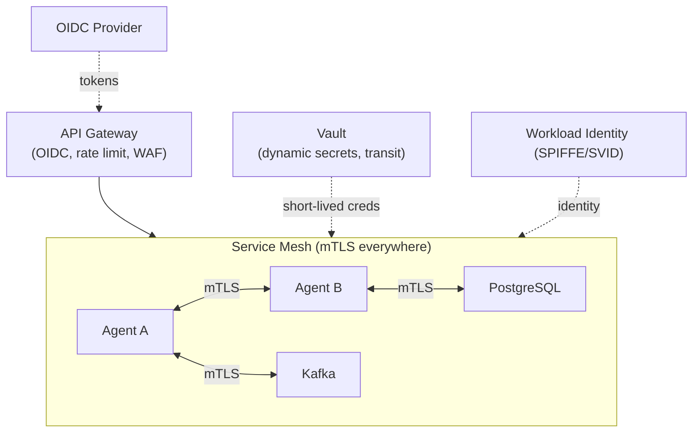

| Control | Implementation |
|---|---|
| Workload identity | SPIFFE/SVID issued per pod; no shared service accounts |
| Transport | mTLS enforced by mesh; plaintext rejected |
| Network policy | Default-deny; explicit allow per service-to-service path |
| Human access | OIDC at the gateway; no direct DB/broker access from laptops |
| Segmentation | Execution + Risk in a higher-trust segment with stricter egress |

### 8.2 Authentication Architecture

- **Human users:** OIDC Authorization Code + PKCE → short-lived JWT access tokens (minutes) + refresh tokens. MFA enforced for `OPERATOR`, `RISK_OFFICER`, `ADMIN`.
- **Services:** SPIFFE workload identity for mesh auth; OAuth2 client-credentials for any cross-trust API calls. No long-lived API keys checked into config.
- **Token validation:** Gateway validates signature, audience, expiry, and scopes; downstream services re-validate (defense in depth).

### 8.3 Authorization Architecture (RBAC)

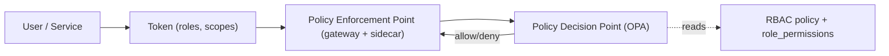

| Role | Capabilities |
|---|---|
| `VIEWER` | Read dashboards, decisions, results |
| `OPERATOR` | Trigger manual cycles, replay DLQ, manage workflows (no risk-limit edits) |
| `RISK_OFFICER` | Read all + edit `risk_limits`, override soft vetoes (audited) |
| `ADMIN` | Full config, registry, RBAC management |
| `SERVICE` | Scoped per-agent topic/table grants (least privilege) |

Authorization decisions are externalized to **OPA**; the `role_permissions` table is the source of truth, evaluated at the gateway (coarse) and per-service sidecar (fine). Every `OVERRIDE`/`APPROVE` action is force-written to `audit.audit_log`.

### 8.4 Secrets Management

| Secret | Handling |
|---|---|
| DB credentials | Vault dynamic secrets, short lease, auto-rotated |
| Feed/API keys | Vault KV v2, referenced by lease, never in env at rest |
| TLS certs | Mesh-managed, auto-rotated (e.g., 24h) |
| Signing keys (audit hash, JWT) | Vault Transit; keys never leave Vault |
| Encryption at rest | DB + S3 envelope encryption with KMS-backed keys |

### 8.5 API & Edge Security

Rate limiting + quota per identity, WAF at the gateway, strict schema validation on all inbound payloads, input size caps, and CORS lockdown. All external feed adapters treat upstream data as untrusted and pass it through validators before it touches the bus.

---

## 9. Observability Architecture

Unified telemetry via **OpenTelemetry** SDKs in every service, exporting to a metrics/traces/logs backend.

### 9.1 Pillars

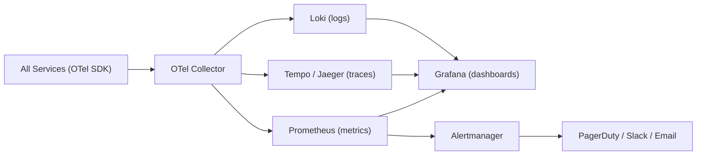

### 9.2 Metrics (examples)

| Metric | Type | Purpose |
|---|---|---|
| `cycle_duration_seconds` | histogram | End-to-end cycle latency by priority |
| `agent_result_latency_seconds{agent}` | histogram | Per-agent responsiveness |
| `agent_timeout_total{agent}` | counter | Quorum-affecting timeouts |
| `decision_total{recommendation}` | counter | APPROVE/REJECT/HOLD distribution |
| `risk_veto_total{type}` | counter | Veto frequency (capital-preservation signal) |
| `dlq_depth{topic}` | gauge | Failure backlog |
| `consumer_lag{topic,group}` | gauge | Backpressure detection |
| `conflict_detected_total` | counter | Signal-disagreement rate |

### 9.3 Logging Architecture

Structured JSON logs, every line carrying `cycle_id`, `trace_id`, `agent_type`, and `severity`. No secrets/PII in logs (enforced by a redaction processor in the collector). Log levels are runtime-tunable per service. Retention: hot 14 days in Loki, cold archive to S3 (1y+ for audit-relevant streams).

### 9.4 Tracing

W3C `traceparent` is created at cycle open and propagated through every event header and DB span, giving a single distributed trace from trigger → analysis → risk → approval → execution. This makes "why did this decision happen?" answerable in one trace view.

### 9.5 Dashboards & Alerting

| Dashboard | Audience | Key panels |
|---|---|---|
| Decision Flow | Operators | Cycle throughput, latency, recommendation mix |
| Agent Health | Engineers | Per-agent latency, error/timeout rates, consumer lag |
| Risk Posture | Risk officers | Veto rate, drawdown, exposure, limit breaches |
| Data Quality | Data eng | Ingestion freshness, invalid-event DLQ rate |
| Audit Integrity | Compliance | Hash-chain verifier status, override log |

**Alert examples:** quorum failure rate > X%, `dlq_depth` rising, consumer lag breach, audit hash-chain verification failure (critical), Risk Agent unable to read portfolio state (critical → forces conservative veto).

---

## 10. Disaster Recovery

### 10.1 Objectives

| Tier | Component | RPO | RTO |
|---|---|---|---|
| 1 | PostgreSQL (decisions, audit, risk) | ≤ 1 min | ≤ 15 min |
| 1 | Kafka (decision/execution topics) | 0 (replicated) | ≤ 10 min |
| 2 | TimescaleDB (market/whale) | ≤ 5 min | ≤ 30 min |
| 3 | Redis (ephemeral) | best-effort (rebuildable) | ≤ 5 min |
| 3 | S3/MinIO | cross-region replicated | ≤ 30 min |

### 10.2 Strategy

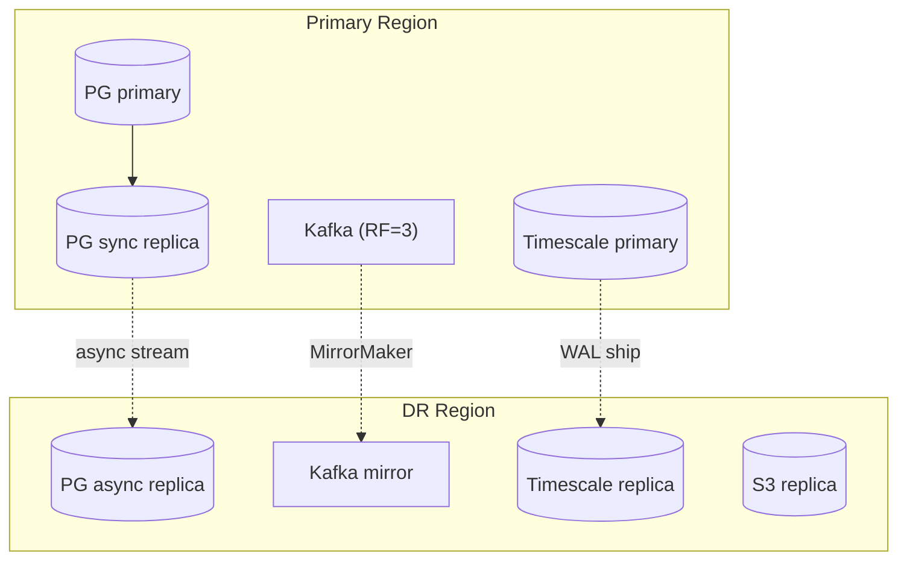

- **PostgreSQL:** synchronous local replica + asynchronous cross-region replica; continuous WAL archiving + PITR.
- **Kafka:** replication factor 3 in-region; MirrorMaker to DR region for tier-1 topics.
- **State rebuild:** because all decisions/executions are event-sourced and replayable, the system can deterministically reconstruct read models by replaying `decision.made` / `execution.recorded` from the durable log.
- **Idempotency + replay-safety** mean replay never double-executes (Execution side effects keyed by `decision_id`).
- **Failover:** DNS/mesh-driven promotion of DR replicas; runbooks define promotion order (datastores → broker → orchestrator → agents).
- **Backups:** nightly full + continuous incremental; quarterly restore drills with documented verification.

### 10.3 Graceful Degradation

| Failure | Behavior |
|---|---|
| One analysis agent down | Cycle proceeds with reduced quorum → biased toward `HOLD` |
| Risk Agent down / no portfolio state | **Conservative veto**: no APPROVE possible |
| Approval Agent down | Cycles queue; no decisions emitted (fail-safe, never auto-approve) |
| Execution boundary down | Workflow holds at `STAGED`; retried; audited |
| Kafka partial outage | Producers buffer with backpressure; degraded but consistent |

---

## 11. Deployment Models

### 11.1 Local Development

Single-host (Docker-Compose-style topology, described not scripted): one Kafka broker, one Postgres+Timescale, one Redis, MinIO, and all agents as single replicas. Mocked external feeds via a replayable fixture stream. Vault/OIDC in dev mode. Purpose: full end-to-end cycle on a laptop.

### 11.2 Single-Server Deployment

All components on one VM via a local orchestrator (k3s or compose). Suitable for staging/pilot. No HA; backups to external object store. Resource isolation via cgroups/namespaces.

### 11.3 Cloud Deployment (standard)

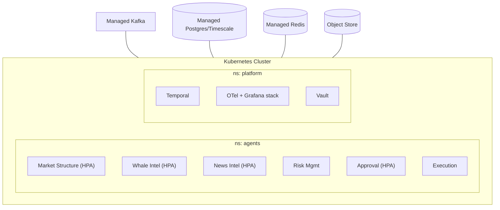

Managed datastores where available; agents as autoscaled deployments; mesh for mTLS; secrets via Vault; GitOps for declarative config.

### 11.4 High-Availability Deployment

Multi-AZ within region + DR region (§10). Minimums: Kafka RF=3 across 3 AZs; Postgres primary + sync replica (different AZ) + async DR replica; ≥2 replicas of every stateless agent with pod anti-affinity; Approval/Execution backed by Temporal cluster (HA). Zero-downtime rollouts via canary + readiness gating. Active-passive across regions with automated promotion.

| Capability | Single Server | Cloud | HA |
|---|---|---|---|
| Redundancy | None | AZ-level | Multi-AZ + DR region |
| Autoscaling | No | Yes | Yes |
| RTO | hours | ~30 min | ≤15 min |
| Use | pilot/staging | production | regulated production |

---

## 12. Scaling Strategy

### 12.1 Dimensions

| Dimension | Approach |
|---|---|
| **More instruments** | Topics keyed by instrument → add partitions; agents scale horizontally per partition |
| **More agents** | Register in `agent_registry`; consensus weights config-driven; no orchestrator change |
| **Higher cycle frequency** | Increase Approval/Orchestrator replicas; partition by `cycle_id` |
| **Heavier NLP/inference** | Dedicated GPU node pool for News Intel; batch+stream hybrid |
| **Data volume** | Timescale compression + tiered storage; cold data to S3 Parquet |
| **Read load** | Postgres read replicas for dashboards/reporting (never on the decision write path) |

### 12.2 Bottleneck Management

- **Consensus is the natural serialization point** per cycle but is parallel *across* cycles (partitioned by `cycle_id`) — so throughput scales with partitions.
- **Backpressure** is observed via consumer lag; HPA scales on lag + CPU + custom `cycle_queue_depth`.
- **Hot instruments** (e.g., BTC during volatility) get more partitions and priority preemption.

### 12.3 Statefulness Map

| Component | State | Scaling |
|---|---|---|
| Market/Whale/News/Approval | Stateless per cycle | Horizontal |
| Risk Agent | Portfolio read model | Vertical + replica read model |
| Orchestrator/Temporal | Durable workflow store | Clustered |
| Datastores | Stateful | Managed/replicated |

---

## 13. Future Roadmap & Extensibility

### 13.1 Extension Mechanism

A new agent is added by (1) defining its `agent.result` evidence schema in the registry, (2) inserting an `agent_registry` row (tier, weight, quorum flag), and (3) deploying the service. The consensus engine, audit log, and observability stack absorb it with **zero code change** to existing components — this is the payoff of the common contract (§4.0) and config-driven weights.

### 13.2 Planned Agents

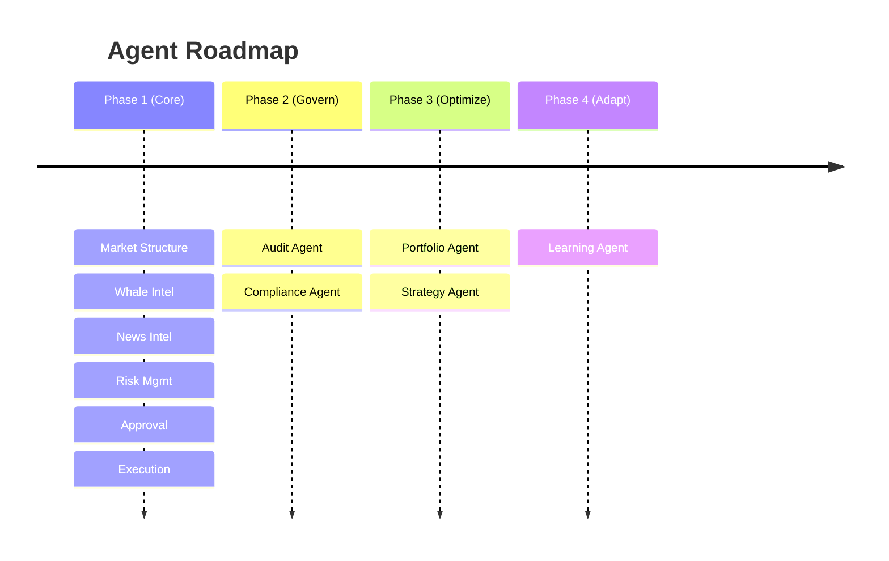

| Future agent | Role | Tier | Veto? |
|---|---|---|---|
| **Audit Agent** | Continuous independent verification of the hash chain + decision reproducibility; flags anomalies | side-car | No |
| **Compliance Agent** | Pre-decision regulatory/policy checks (jurisdiction, restricted lists); can block | 1.5 | Yes (compliance veto) |
| **Portfolio Agent** | Position sizing, rebalancing recommendations feeding Risk + Approval | 1 | No |
| **Strategy Agent** | Higher-order regime/strategy selection adjusting agent weights per regime | 0.5 | No (weights only) |
| **Learning Agent** | Offline: evaluates realized outcomes vs. decisions, proposes weight/policy updates (human-approved) | offline | No |

> **Safety rule for the Learning Agent:** it operates **offline** and proposes changes to policy/weights; it never mutates live consensus autonomously. All learned changes ship through versioned `policy_version` config with human sign-off, preserving the "no single agent decides" invariant.

### 13.3 Architectural Evolution Candidates

- **Feature store** between L2 and agents for reusable, versioned features.
- **Model registry** for News/Market model versioning + canary inference.
- **Multi-region active-active** decisioning (requires consensus on partitioning of `cycle_id` ownership).
- **Pluggable execution venues** behind the Execution boundary with per-venue adapters and policy gates.

---

## 14. Appendix: Glossary & Conventions

| Term | Meaning |
|---|---|
| **Decision Cycle** | One traceable analysis→decision sequence for an `(instrument, timeframe)`, identified by `cycle_id` |
| **Quorum** | The set of `required_for_quorum` agents whose results are needed before consensus |
| **Veto** | Risk/compliance hard or soft block that overrides bullish consensus |
| **Signal-blind** | Property of the Execution Agent: never originates or computes signals |
| **Tier** | Dependency level used for scheduling (0 independent → 3 execution) |
| **DLQ** | Dead-letter queue for messages that exhausted retries |
| **Policy version** | Versioned thresholds/weights recorded on every decision for reproducibility |
| **Tamper-evident** | Audit chain where any edit breaks a verifiable hash linkage |

**Conventions**
- All timestamps are RFC3339 UTC.
- All inter-service identifiers are UUIDv4 unless noted.
- All monetary values are stored with explicit precision (`NUMERIC`), never floats.
- Enum-like text fields are application-enforced and registry-documented to keep schemas migration-light.

---

*End of document. This specification is implementation-agnostic by design; technology choices are recommendations with stated rationale and may be substituted provided the contracts, invariants (P1–P8), and service boundaries are preserved.*
